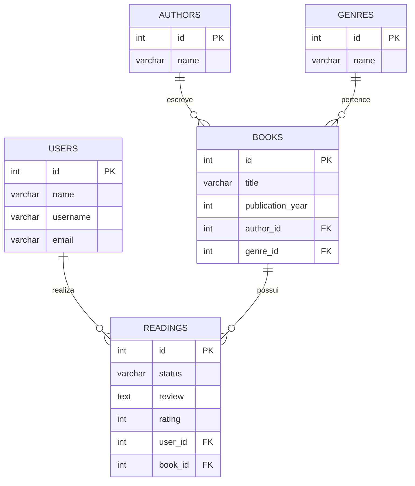

# eLibrary API


Uma API RESTful completa desenvolvida para o gerenciamento de catálogos de livros e acompanhamento do progresso de leitura.

> **Status de hospedagem:** Esta aplicação foi originalmente implementada em produção utilizando a plataforma [Render](https://render.com/docs/postgresql). Atualmente, o deploy encontra-se pausado/offline devido a limitações de infraestrutura gratuita, mas o projeto está funcional para execução e testes em ambiente local.

## 🔴 Funcionalidades

- [x] Gerenciamento completo via CRUD de um catálogo literário, com relacionamentos entre Livros, Autores e Gêneros;
- [x] Controle e acompanhamento do histórico de leituras do usuário, registrando o livro, status atual da leitura, nota (rating) e resenha (review);
- [x] Sistema de login com geração e validação de [JSON Web Token (JWT)](https://www.jwt.io/introduction#what-is-json-web-token), com controle de acesso para operações de escrita;
- [x] Separação de acesso com rotas públicas para leitura de catálogos e criação de usuários, e rotas privadas protegidas por middleware para modificação de dados.

## 🟠 Arquitetura

A arquitetura do projeto foi desenhada visando a separação de responsabilidades. Abaixo, o Modelo Entidade-Relacionamento (MER) do banco de dados:



Das características da implementação do código:

- Fluxo de dados respeitando a hierarquia em camadas: <mark>**&nbsp;Routes → Controllers → UseCases → Entities&nbsp;**</mark>, com as regras de negócio e de banco isoladas nos UseCases;

- Persistência de dados construída utilizando comandos SQL puros, com:
  - Uso de CTEs (Common Table Expressions) com a cláusula `WITH` para realizar `INSERT` simultâneo a `JOIN` na mesma transação de forma otimizada (ex: criação de livros);

  - Uso de `RETURNING` para mapeamento de entidades sem a necessidade de `SELECT` adicional;

  - Controle de relacionamentos e exclusões (ex: manipulação manual de regras de `DELETE CASCADE` ao deletar usuários com leituras ativas com tratamento do erro de integridade `23503`);

- Funções utilitárias (mappers) para transformar os dados recebidos do banco em objetos JavaScript estruturados de fácil manipulação antes de serem enviados na resposta HTTP.

## 🟡 Endpoints

Todas as respostas da API seguem um formato JSON previsível para facilitar a integração pelo front-end.

**Exemplo de Sucesso (200 OK / 201 Created):**

```json
{
  "status": "success",
  "message": "Operação realizada com sucesso!",
  "objeto": {
    "id": 1,
    "name": "Exemplo"
  }
}
```

**Exemplo de Erro (400 Bad Request / 401 Unauthorized / 409 Conflict):**

```json
{
  "message": "Erro ao realizar operação: detalhamento do erro",
  "status": "error"
}
```

##

> **Observação:** rotas com o emoji de cadeado (🔒) indicam necessidade de autenticação via Header (`Authorization: Bearer <token>`).

- ### Users

  | Método | Rota         | Descrição                        | Status | Auth |
  | ------ | ------------ | -------------------------------- | ------ | ---- |
  | POST   | `/login`     | Autentica o usuário e gera o JWT | `200`  | 🌐   |
  | POST   | `/users`     | Cadastra um novo usuário         | `201`  | 🌐   |
  | GET    | `/users`     | Lista todos os usuários          | `200`  | 🔒   |
  | GET    | `/users/:id` | Retorna um usuário específico    | `200`  | 🔒   |
  | PUT    | `/users/:id` | Atualiza os dados de um usuário  | `200`  | 🔒   |
  | DELETE | `/users/:id` | Remove o usuário e suas leituras | `200`  | 🔒   |

- ### Books

  | Método | Rota         | Descrição                  | Status | Auth |
  | ------ | ------------ | -------------------------- | ------ | ---- |
  | GET    | `/books`     | Lista o catálogo de livros | `200`  | 🌐   |
  | POST   | `/books`     | Cadastra um novo livro     | `201`  | 🔒   |
  | PUT    | `/books/:id` | Atualiza dados do livro    | `200`  | 🔒   |
  | DELETE | `/books/:id` | Remove livro               | `200`  | 🔒   |

- ### Authors

  | Método | Rota           | Descrição                | Status | Auth |
  | ------ | -------------- | ------------------------ | ------ | ---- |
  | GET    | `/authors`     | Lista o todos os autores | `200`  | 🌐   |
  | POST   | `/authors`     | Cadastra um novo autor   | `201`  | 🔒   |
  | PUT    | `/authors/:id` | Atualiza dados do autor  | `200`  | 🔒   |
  | DELETE | `/authors/:id` | Remove autor             | `200`  | 🔒   |

- ### Genres

  | Método | Rota          | Descrição                | Status | Auth |
  | ------ | ------------- | ------------------------ | ------ | ---- |
  | GET    | `/genres`     | Lista o todos os gêneros | `200`  | 🌐   |
  | POST   | `/genres`     | Cadastra um novo gênero  | `201`  | 🔒   |
  | PUT    | `/genres/:id` | Atualiza dados do gênero | `200`  | 🔒   |
  | DELETE | `/genres/:id` | Remove gênero            | `200`  | 🔒   |

- ### Readings
  | Método | Rota            | Descrição                         | Status | Auth |
  | ------ | --------------- | --------------------------------- | ------ | ---- |
  | GET    | `/readings`     | Lista todas as leituras           | `200`  | 🌐   |
  | POST   | `/readings`     | Inicia uma leitura para o usuário | `201`  | 🔒   |
  | PUT    | `/readings/:id` | Atualiza status, nota e resenha   | `200`  | 🔒   |
  | DELETE | `/readings/:id` | Remove um registro de leitura     | `200`  | 🔒   |

## 🟢 Execução

**Pré-requisitos:** Node.js e PostgreSQL instalados.

```bash
# Clone o repositório
git clone https://github.com/barbarastella/elibrary-backend.git

# Acesse a pasta do projeto
cd elibrary-backend

# Instale as dependências
npm install

# Configure as seguintes variáveis de ambiente baseadas no .env.example
# DATABASE_URL: inserir usuário, senha e nome do banco conforme modelo
# PORT: porta do servidor Express (geralmente 3000)
# SECRET: chave de assinatura do JWT

# Inicie o servidor
npm run dev
```

## 🔵 Contato

<p align="left">
  Em caso de dúvidas ou comentários, entre em contato:&nbsp;
  
  <a href="https://www.linkedin.com/in/barbara-wehrmann/" title="LinkedIn">
    
  </a>
  <a href="mailto:barbarastellaw@gmail.com" title="Gmail">
    
  </a>
  <a href="https://www.instagram.com/barbarastellaw" title="Instagram">
    
  </a>
</p>
